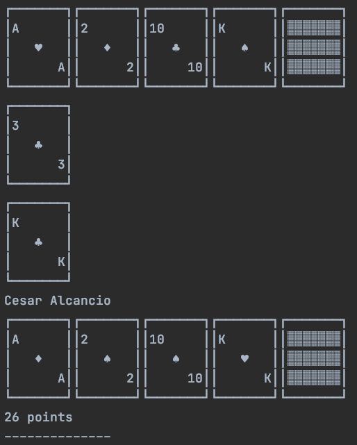

# card-ascii-art

This is a project to represent a card illustration using ascii.

## Usage

Add to the dependencies:

```clojure
[org.clojars.cesaralcancio/card-ascii-art "0.3.0"]
```

Example:
```clojure
(defproject my-project "0.1.0-SNAPSHOT"
  :description "My project description"
  :url "http://myproject.com"
  :license {:name "EPL-2.0 OR GPL-2.0-or-later WITH Classpath-exception-2.0"
            :url "https://www.eclipse.org/legal/epl-2.0/"}
  :dependencies [[org.clojure/clojure "1.10.1"]
                 [org.clojars.cesaralcancio/card-ascii-art "0.1.0"]]
  :repl-options {:init-ns my-project.core})

```

How to use:
```clojure
(ns my-namespace.my-file
  (:require [card-ascii-art.core :as card-core]))

(card-core/print-cards [1 2 10 13 "X"])

(card-core/print-card 3)

(card-core/print-card 13)

(card-core/print-player {:cards       [1 2 10 13 "X"]
                         :player-name "Cesar Alcancio"
                         :points      26})
```



## License

Copyright © 2021 FIXME

This program and the accompanying materials are made available under the
terms of the Eclipse Public License 2.0 which is available at
http://www.eclipse.org/legal/epl-2.0.

This Source Code may also be made available under the following Secondary
Licenses when the conditions for such availability set forth in the Eclipse
Public License, v. 2.0 are satisfied: GNU General Public License as published by
the Free Software Foundation, either version 2 of the License, or (at your
option) any later version, with the GNU Classpath Exception which is available
at https://www.gnu.org/software/classpath/license.html.
